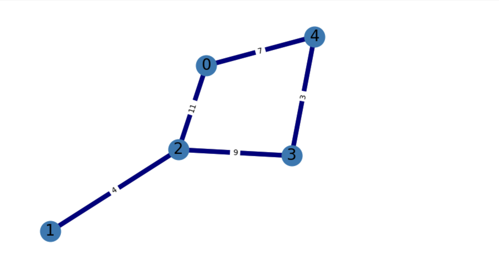

# Traffic Network Optimization Simulation

A Python and NetworkX project that simulates city traffic and recommends new roads to reduce travel distance and congestion.

## Overview

The road network is modeled as a weighted graph where:

- Nodes represent city locations
- Edges represent bidirectional roads
- Edge weights represent road distances

The simulation generates random trips across the network and uses the A* algorithm to determine shortest routes.

## Network Example

## Technologies

- Python
- NetworkX
- Matplotlib
- A* Search
- Graph Algorithms

## Simulation

- 60 nodes
- 100 trips generated per second
- 36,000 simulation ticks
- Random road lengths between 5 and 25 miles
- Connected random graph
- Candidate roads ranked using a benefit calculation

## How It Works

1. Generate a connected weighted road network.
2. Simulate traffic between randomly selected locations.
3. Use A* to determine shortest paths.
4. Record traffic volumes.
5. Evaluate unconnected node pairs as possible new roads.
6. Calculate travel-distance savings and traffic benefit.
7. Rank the highest-value road recommendations.

## Experiments

### R3
Tested the baseline 60-node network with shrinkage factor 0.6.

### R4
Changed the shrinkage factor from 0.6 to 0.8 and compared how the recommended roads changed.

### R5
Increased network connectivity and analyzed how the value of new roads changed.

## Key Takeaway

As network connectivity increased, the benefit of adding new roads decreased because the existing network already provided more direct routes.

## Results

The simulation compared multiple road-network scenarios and ranked candidate roads based on projected travel-distance savings and traffic volume.

- With a lower shrinkage factor, new direct roads produced larger travel savings.
- Increasing the shrinkage factor changed the ranking of recommended roads because new roads became less beneficial.
- Increasing overall network connectivity reduced the value of adding new roads because the existing network already provided shorter routes.

The project demonstrated how graph structure and road-length assumptions can affect infrastructure recommendations.

## Skills Demonstrated

- Graph modeling
- A* shortest-path search
- Python programming
- Simulation
- Algorithm design
- Data analysis
- Problem solving
